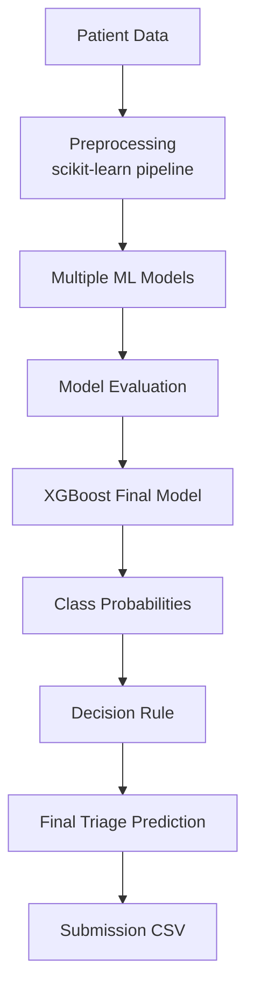

<div align="center">

# 🚑 Healthcare Triage Classification

### AI/ML-Assisted, Cost-Aware Decision Support for START Triage

**Problem Statement:** `MM26ML03` &nbsp;•&nbsp; **Team ID:** `MM2626` &nbsp;•&nbsp; **Modelling Minds 2.0 (ML Track)**


</div>

---

> **Disclaimer:** This is a hackathon AI/ML decision-support prototype. It does not diagnose patients and is not a replacement for medical professionals or clinical judgment.

## 📌 Overview

This project addresses the **MM26ML03 Healthcare Triage Classification** problem using supervised machine learning. It predicts one of four triage categories (**RED, YELLOW, GREEN, BLACK**) from patient-level tabular data, and evaluates every model against the **official competition misclassification cost matrix**, because different errors carry different costs.

### At a Glance

| | |
|---|---|
| **Task** | Supervised multiclass classification |
| **Target** | `start_category` |
| **Final model** | XGBoost |
| **Validation accuracy** | 0.9323 |
| **Validation Macro-F1** | 0.9325 |
| **Total misclassification cost** | 33 (lower is better) |
| **5-fold CV accuracy** | 0.9141 ± 0.0163 |
| **Main notebook** | `Syntax.ipynb` |

---

## 🩺 Problem Statement

In mass-casualty or high-volume emergency situations, medical staff must rapidly sort patients by treatment urgency using the **START (Simple Triage and Rapid Treatment)** protocol. Manual triage under time pressure is error-prone, and classifying a critical patient as stable can be far more harmful than over-triaging a stable one.

The task is to build a machine learning model that predicts the triage category from patient data while explicitly accounting for these unequal error costs using the provided cost matrix.

| Class | Meaning |
|---|---|
| 🔴 **RED** | Immediate treatment required |
| 🟡 **YELLOW** | Delayed treatment may be possible |
| 🟢 **GREEN** | Minor injuries / ambulatory patients |
| ⚫ **BLACK** | Deceased or expectant patients |

---

## 🗂️ Dataset

The dataset is provided by the competition as separate train and test CSV files.

| Item | Details |
|---|---|
| **Train rows** | 664 |
| **Test rows** | 112 |
| **Target** | `start_category` |
| **Features used** | 37 (31 numeric, 6 categorical), after removing `subject_id` |

**Data includes:** demographics, arrival transport, vital signs, GCS, AVPU/consciousness, pain information, chief complaint, historical vital-sign aggregates, and diagnosis/medication/vital-sign counts.

**Training class distribution:** 🟡 YELLOW 284 · 🟢 GREEN 176 · 🔴 RED 135 · ⚫ BLACK 69

---

## 🧭 ML Pipeline



---

## 🧹 Preprocessing

Preprocessing is implemented inside a scikit-learn pipeline to avoid data leakage.

- `subject_id` is excluded from predictive features and used only for patient identification in the submission.
- Numerical missing values: **median imputation**.
- Categorical missing values: **most-frequent imputation**.
- Categorical variables: **one-hot encoding**.
- The dataset already provides useful derived features such as GCS total and minimum/maximum/mean historical vital signs.
- Additional missingness indicators were tested but did not provide enough improvement to become part of the main approach.

---

## 🧪 Models Tested

| # | Model / Approach |
|:-:|---|
| 1 | Logistic Regression |
| 2 | Random Forest |
| 3 | Gradient Boosting |
| 4 | XGBoost |
| 5 | LightGBM |
| 6 | CatBoost |
| 7 | XGBoost + CatBoost ensemble |
| 8 | Optuna-tuned XGBoost |
| 9 | Cost-aware decision rule |

---

## 🏆 Final Model

The final model is **XGBoost** with the following settings:

```text
n_estimators     = 400
max_depth        = 5
learning_rate    = 0.05
subsample        = 0.85
colsample_bytree = 0.85
```

The model was retrained on all 664 training rows before generating the final test predictions. The XGBoost + CatBoost ensemble matched XGBoost with a total cost of 33, and Optuna-tuned XGBoost had a total cost of 36, so the simpler single XGBoost model was selected.

---

## ✅ Validation

- **Stratified 80/20 hold-out split**, giving 133 validation samples, used for model comparison.
- **5-fold stratified cross-validation** for XGBoost, with mean accuracy **0.9141 ± 0.0163**.

| Metric (XGBoost, hold-out) | Value |
|---|---:|
| Accuracy | 0.9323 |
| Macro-F1 | 0.9325 |
| Total misclassification cost | 33 |

---

## 💰 Cost-Sensitive Decision Making

The model first outputs a probability for each of the four classes. The **cost-aware rule** then computes the expected cost of each possible prediction and picks the lowest:

```python
expected_costs = probabilities @ COST_MATRIX
prediction = np.argmin(expected_costs)
```

> In simple terms: the cost-aware rule considers both how likely each class is and how costly each possible mistake would be.

### Official Cost Matrix

The official competition cost matrix was used exactly as provided and was not modified. **Lower total misclassification cost is better.**

| Actual ↓ / Predicted → | 🔴 RED | 🟡 YELLOW | 🟢 GREEN | ⚫ BLACK |
|---|:---:|:---:|:---:|:---:|
| **🔴 RED** | 0 | 5 | 10 | 5 |
| **🟡 YELLOW** | 2 | 0 | 3 | 2 |
| **🟢 GREEN** | 1 | 1 | 0 | 1 |
| **⚫ BLACK** | 2 | 2 | 2 | 0 |

### Decision Rule Selection

Two decision rules were compared on the validation split:

| Decision Rule | Total Cost |
|---|:---:|
| **Highest-probability (argmax)** | **33** |
| Cost-aware expected-cost rule | 35 |

The highest-probability rule achieved the lower validation cost, so it was used for the **final submitted labels**. The cost matrix was used to evaluate all models and decision rules against the competition's asymmetric error costs.

---

## 📏 Evaluation Metrics

- Accuracy
- Per-class Precision, Recall and F1-score
- Macro-F1 and Weighted-F1
- Confusion Matrix
- Total Misclassification Cost

---

## 📊 Model Comparison

Validation results on 133 samples:

| Model | Accuracy | Macro-F1 | Total Cost ↓ |
|---|:---:|:---:|:---:|
| 🥇 **XGBoost** | **0.9323** | **0.9325** | **33** |
| CatBoost | 0.9248 | 0.9268 | 36 |
| Gradient Boosting | 0.9173 | 0.9188 | 39 |
| LightGBM | 0.9248 | 0.9161 | 42 |
| Random Forest | 0.9248 | 0.9161 | 42 |
| Logistic Regression | 0.9098 | 0.9195 | 48 |

---

## 🎯 Per-Class Results

XGBoost on the validation split:

| Class | Precision | Recall | F1 |
|---|:---:|:---:|:---:|
| 🔴 RED | 1.00 | 0.78 | 0.88 |
| 🟡 YELLOW | 0.88 | 1.00 | 0.93 |
| 🟢 GREEN | 1.00 | 0.91 | 0.96 |
| ⚫ BLACK | 0.93 | 1.00 | 0.97 |

---

## 🧩 Confusion Matrix

Rows are **actual** classes and columns are **predicted** classes (XGBoost, validation split).

| Actual ↓ / Predicted → | 🔴 RED | 🟡 YELLOW | 🟢 GREEN | ⚫ BLACK |
|---|:---:|:---:|:---:|:---:|
| **🔴 RED** | 21 | 5 | 0 | 1 |
| **🟡 YELLOW** | 0 | 57 | 0 | 0 |
| **🟢 GREEN** | 0 | 3 | 32 | 0 |
| **⚫ BLACK** | 0 | 0 | 0 | 14 |

RED had the lowest recall (0.78), with 6 of 27 actual RED patients classified as another category. There were **0 RED → GREEN errors** on this split; the cost matrix assigns a cost of 10 to that error.

---

## 🔍 Feature Importance

Important XGBoost features included:

- `gcs_motor`
- Arrival by ambulance
- `vs_resprate_max`
- Chief-complaint categories
- Respiratory and oxygen-saturation related aggregate features

---

## 📁 Repository Structure

```text
MM26ML03-TriageAI/
├── Syntax.ipynb
├── MM2626_MM26ML03.csv
└── README.md
```

| File | Description |
|---|---|
| `Syntax.ipynb` | Main notebook: preprocessing, model training, evaluation and submission generation |
| `MM2626_MM26ML03.csv` | Final competition submission file |
| `README.md` | Project documentation |

---

## 📤 Submission Format

`MM2626_MM26ML03.csv` contains **112 rows** in the original test ordering, with the following columns:

| Column | Description |
|---|---|
| `Patient ID` | Patient identifier (`subject_id`) |
| `Predicted Triage` | RED / YELLOW / GREEN / BLACK |
| `RED Probability` | Model probability for RED |
| `YELLOW Probability` | Model probability for YELLOW |
| `GREEN Probability` | Model probability for GREEN |
| `BLACK Probability` | Model probability for BLACK |

The four probabilities sum to approximately 1 for each patient. All 112 test rows are retained in the original order, including repeated patient IDs.

**Final prediction distribution:**

| Class | Count |
|---|:---:|
| 🟡 YELLOW | 48 |
| 🟢 GREEN | 33 |
| 🔴 RED | 20 |
| ⚫ BLACK | 11 |

---

## ▶️ How to Run

1. Open `Syntax.ipynb` in Google Colab or Jupyter.
2. Supply the competition-provided `train_ml03.csv` and `test_pred_ml03.csv` files. These are **not included in this repository** and must be obtained separately.
3. Install the required packages if needed:

```bash
   pip install xgboost lightgbm catboost optuna
```

4. Run the notebook cells to reproduce preprocessing, model training, evaluation and submission generation.

---

## 🔭 Future Scope

- Better probability calibration
- Further model tuning
- Improved cost-sensitive decision optimization
- Patient-grouped validation to reduce potential patient-level leakage
- Frontend integration for easier patient-data entry and result visualization
- An Agentic AI layer for explanation and workflow support. It would explain predictions and organize workflow information; it would **not** replace the ML classifier or clinical judgment.

---

## ⚠️ Disclaimer

This project is a hackathon AI/ML decision-support prototype. It does not diagnose patients, has not been clinically validated or deployed, and is not a replacement for medical professionals or clinical judgment.

---

<div align="center">

Built for **Modelling Minds 2.0** &nbsp;•&nbsp; Problem Statement **MM26ML03** &nbsp;•&nbsp; Team **MM2626**

</div>
