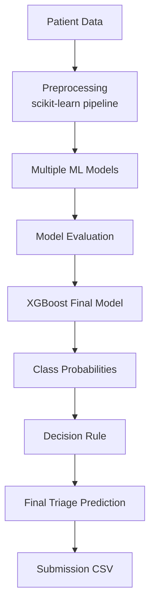
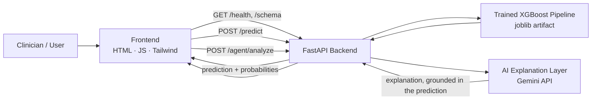

<div align="center">

# 🚑 TriageAI — Healthcare Triage Classification

### ML-Driven, Cost-Aware Decision Support for Emergency Triage — with an AI Explanation Layer

**Problem Statement:** `MM26ML03` &nbsp;•&nbsp; **Team ID:** `MM2626` &nbsp;•&nbsp; **Team Syntax** &nbsp;•&nbsp; **Modelling Minds 2.0 (ML Track)**


</div>

---

> **Disclaimer:** TriageAI is a hackathon AI/ML decision-support prototype. It does not diagnose patients, does not prescribe treatment, has not been clinically validated, and is not a replacement for medical professionals or clinical judgment.

## 📌 Overview

TriageAI is an end-to-end machine-learning decision-support prototype built for the **MM26ML03 Healthcare Triage Classification** problem statement. It predicts one of four emergency triage categories — **RED, YELLOW, GREEN, BLACK** — from patient-level tabular data, and evaluates every model against the **official competition misclassification cost matrix**, because different triage errors carry different costs.

Beyond the notebook, TriageAI ships as a full application: a **FastAPI backend** serving the trained XGBoost pipeline, a **web frontend** for entering patient data and viewing predictions, and an **AI explanation layer** that puts the model's output into plain language.

**Core principle:**

> **XGBoost makes the prediction. The AI agent explains the prediction.**

The AI explanation layer never changes, overrides, or substitutes for the XGBoost classifier's output — it only describes it.

### At a Glance

| | |
|---|---|
| **Task** | Supervised multiclass classification |
| **Target** | `start_category` |
| **Final model** | XGBoost |
| **Validation accuracy** | 0.9323 |
| **Validation Macro-F1** | 0.9325 |
| **Total misclassification cost** | 33 (lower is better) |
| **5-fold CV accuracy** | 0.9141 ± 0.0163 |
| **Application** | FastAPI backend + web frontend + AI explanation layer |
| **Main notebook** | `Syntax.ipynb` |

---

## 🎯 Project Objective

Build a machine-learning system that classifies emergency patients into triage categories from patient-level data, explicitly accounting for the asymmetric cost of misclassification, and deliver it as a working application — not just a notebook — where a clinician-facing form produces a live prediction with probabilities, and an AI layer explains that prediction in plain language without altering it.

---

## 🩺 Problem Statement

In mass-casualty or high-volume emergency situations, medical staff must rapidly sort patients by treatment urgency. Manual triage under time pressure is error-prone, and classifying a critical patient as stable can be far more harmful than over-triaging a stable one.

The task is to predict the triage category from patient data while explicitly accounting for these unequal error costs using the provided cost matrix.

| Class | Meaning |
|---|---|
| 🔴 **RED** | Immediate treatment required |
| 🟡 **YELLOW** | Delayed treatment may be possible |
| 🟢 **GREEN** | Minor injuries / ambulatory patients |
| ⚫ **BLACK** | Deceased or expectant patients |

---

## 🗂️ Dataset

| Item | Details |
|---|---|
| **Train rows** | 664 |
| **Test rows** | 112 |
| **Target** | `start_category` |
| **Predictive features** | 37 (31 numeric, 6 categorical), after removing `subject_id` |
| **Excluded identifier** | `subject_id` |

**Data includes:** demographics, arrival transport, vital signs, GCS, AVPU/consciousness, pain information, chief complaint, historical vital-sign aggregates, and diagnosis/medication/vital-sign counts.

**Training class distribution:** 🟡 YELLOW 284 · 🟢 GREEN 176 · 🔴 RED 135 · ⚫ BLACK 69

---

## 🧭 ML Pipeline



### Application Architecture



---

## 🧹 Preprocessing

Preprocessing is implemented inside a scikit-learn pipeline to avoid data leakage, and the **same pipeline structure serves live predictions** in the backend.

- `subject_id` is excluded from predictive features and used only for identification.
- Numerical missing values: **median imputation**.
- Categorical missing values: **most-frequent imputation**.
- Categorical variables: **one-hot encoding**.

---

## 🧪 Models Tested

| # | Model / Approach |
|:-:|---|
| 1 | Logistic Regression |
| 2 | Random Forest |
| 3 | Gradient Boosting |
| 4 | XGBoost |
| 5 | LightGBM |
| 6 | CatBoost |
| 7 | XGBoost + CatBoost ensemble |
| 8 | Optuna-tuned XGBoost |
| 9 | Cost-aware decision rule |

---

## 🏆 Final Model

The final model is **XGBoost** with the following settings:

```text
n_estimators     = 400
max_depth        = 5
learning_rate    = 0.05
subsample        = 0.85
colsample_bytree = 0.85
```

XGBoost was selected after comparing model performance and misclassification cost. The XGBoost + CatBoost ensemble matched XGBoost's validation cost, and Optuna-tuned XGBoost produced a higher cost — so the standard XGBoost model was retained as final.

---

## ✅ Model Evaluation

- **Validation method:** Stratified 80/20 hold-out split — 133 validation samples.
- **5-fold stratified cross-validation** for XGBoost: mean accuracy **0.9141 ± 0.0163**.

| Metric (XGBoost, hold-out) | Value |
|---|---:|
| Accuracy | 0.9323 |
| Macro-F1 | 0.9325 |
| Weighted-F1 | 0.9311 |
| Total misclassification cost | 33 |

### Per-Class Results

| Class | Precision | Recall | F1 |
|---|:---:|:---:|:---:|
| 🔴 RED | 1.00 | 0.78 | 0.88 |
| 🟡 YELLOW | 0.88 | 1.00 | 0.93 |
| 🟢 GREEN | 1.00 | 0.91 | 0.96 |
| ⚫ BLACK | 0.93 | 1.00 | 0.97 |

---

## 💰 Cost-Aware Evaluation

The official competition cost matrix was used exactly as provided. **Lower total misclassification cost is better.**

| Actual ↓ / Predicted → | 🔴 RED | 🟡 YELLOW | 🟢 GREEN | ⚫ BLACK |
|---|:---:|:---:|:---:|:---:|
| **🔴 RED** | 0 | 5 | 10 | 5 |
| **🟡 YELLOW** | 2 | 0 | 3 | 2 |
| **🟢 GREEN** | 1 | 1 | 0 | 1 |
| **⚫ BLACK** | 2 | 2 | 2 | 0 |

### Decision Rule Comparison

| Decision Rule | Total Cost |
|---|:---:|
| **Highest-probability (argmax)** | **33** |
| Cost-aware expected-cost rule | 35 |

The highest-probability rule achieved the lower validation cost, so it was used for the **final submitted labels**.

---

## 📊 Model Comparison

Validation results on 133 samples:

| Model | Accuracy | Macro-F1 | Total Cost ↓ |
|---|:---:|:---:|:---:|
| 🥇 **XGBoost** | **0.9323** | **0.9325** | **33** |
| CatBoost | 0.9248 | 0.9268 | 36 |
| Gradient Boosting | 0.9173 | 0.9188 | 39 |
| LightGBM | 0.9248 | 0.9161 | 42 |
| Random Forest | 0.9248 | 0.9161 | 42 |
| Logistic Regression | 0.9098 | 0.9195 | 48 |

---

## 🧩 Confusion Matrix

Rows are **actual** classes and columns are **predicted** classes (XGBoost, validation split).

| Actual ↓ / Predicted → | 🔴 RED | 🟡 YELLOW | 🟢 GREEN | ⚫ BLACK |
|---|:---:|:---:|:---:|:---:|
| **🔴 RED** | 21 | 5 | 0 | 1 |
| **🟡 YELLOW** | 0 | 57 | 0 | 0 |
| **🟢 GREEN** | 0 | 3 | 32 | 0 |
| **⚫ BLACK** | 0 | 0 | 0 | 14 |

RED had the lowest recall (0.78). There were **0 RED → GREEN errors** on this split — the cost matrix assigns a cost of 10 to that specific error.

---

## 💻 TriageAI Application

The project is not notebook-only — it ships as a working application built on the same trained pipeline.

| Layer | Technology |
|---|---|
| **Frontend** | HTML, JavaScript, Tailwind CSS |
| **Backend** | FastAPI |
| **Model serving** | Trained XGBoost pipeline (joblib artifact) + feature schema |
| **AI explanation layer** | Gemini API |

### Frontend Capabilities

- Dashboard with model status
- Patient assessment form
- Live model / API status indicator
- Prediction results view
- Probability visualization
- Analytics (validation performance, confusion matrix, cost-aware evaluation, model comparison)
- Model information page
- AI-assisted explanation of each prediction

---

## 🔌 Backend API

| Endpoint | Method | Purpose |
|---|:---:|---|
| `/health` | `GET` | Check API and model availability |
| `/schema` | `GET` | Return the model's input schema |
| `/predict` | `POST` | Generate an XGBoost prediction |
| `/agent/analyze` | `POST` | Generate an AI-assisted explanation of a prediction |

```bash
# Example: request a prediction
curl -X POST http://localhost:8000/predict \
  -H "Content-Type: application/json" \
  -d '{"heartrate": 112, "resprate": 28, "gcs_motor": 6, "arrival_transport": "AMBULANCE"}'
```

```json
{
  "prediction": "RED",
  "probabilities": {
    "RED": 0.0,
    "YELLOW": 0.0,
    "GREEN": 0.0,
    "BLACK": 0.0
  }
}
```

---

## 🤖 AI Explanation Layer

TriageAI includes an AI-assisted explanation layer, built on the **Gemini API**, that puts the XGBoost prediction into plain language.

**The AI agent receives:**
- the XGBoost prediction
- the model's class probabilities
- the submitted patient features

**The AI agent is instructed to:**
- ✅ never change the model's prediction
- ✅ never invent patient information
- ✅ not diagnose
- ✅ not prescribe treatment
- ✅ explain the submitted information
- ✅ mention uncertainty when appropriate
- ✅ distinguish its output from clinical judgment

> **XGBoost makes the prediction. The AI agent explains the prediction.** The explanation layer does not replace or override the classifier at any point in the pipeline.

---

## 🔐 Security / API Key Handling

- The Gemini API key is read from an environment variable (`GEMINI_API_KEY`) via `backend/.env`.
- `backend/.env` is **excluded from version control** and must be created locally by whoever runs the project.
- No API keys are hardcoded in `app.py`, `agent.py`, or any committed file.

---

## 📁 Repository Structure

```text
MM26ML03-TriageAI/
│
├── Syntax.ipynb
├── MM2626_MM26ML03.csv
├── README.md
├── .gitignore
│
├── frontend/
│   ├── index.html
│   └── triage-live.js
│
└── backend/
    ├── app.py
    ├── agent.py
    ├── train_model.py
    ├── requirements.txt
    ├── train_ml03.csv
    │
    └── artifacts/
        ├── triage_pipeline.joblib
        └── feature_schema.json
```

| File / Folder | Description |
|---|---|
| `Syntax.ipynb` | Main notebook: preprocessing, model training, evaluation and submission generation |
| `MM2626_MM26ML03.csv` | Final competition submission file |
| `frontend/` | Web UI — patient assessment, results, analytics, model info |
| `backend/app.py` | FastAPI application exposing `/health`, `/schema`, `/predict` |
| `backend/agent.py` | AI explanation layer (Gemini API) |
| `backend/train_model.py` | Reproduces the final XGBoost pipeline and exports the artifact |
| `backend/artifacts/` | Trained pipeline (`triage_pipeline.joblib`) and its feature schema |

**Intentionally excluded from Git:**

```text
backend/.env
backend/.venv/
.DS_Store
__pycache__/
```

---

## ▶️ How to Run

**1. Clone the repository**

```bash
git clone https://github.com/Drax1045/MM26ML03-TriageAI.git
cd MM26ML03-TriageAI
```

**2. Set up the backend environment**

```bash
cd backend
python3 -m venv .venv
source .venv/bin/activate
```

**3. Install dependencies**

```bash
pip install -r requirements.txt
```

**4. Configure the AI explanation layer**

Create `backend/.env`:

```env
GEMINI_API_KEY=YOUR_REAL_KEY
```

**5. Run the backend**

```bash
uvicorn app:app --reload
```

Backend available at: **http://localhost:8000**

**6. Open the frontend**

```bash
open frontend/index.html
```

---

## 🏁 Competition Submission

`MM2626_MM26ML03.csv` contains **112 rows** in the original test ordering:

| Column | Description |
|---|---|
| Patient identifier | `subject_id` |
| Predicted triage category | RED / YELLOW / GREEN / BLACK |
| RED probability | Model probability for RED |
| YELLOW probability | Model probability for YELLOW |
| GREEN probability | Model probability for GREEN |
| BLACK probability | Model probability for BLACK |

**Final prediction distribution:**

| Class | Count |
|---|:---:|
| 🟡 YELLOW | 48 |
| 🟢 GREEN | 33 |
| 🔴 RED | 20 |
| ⚫ BLACK | 11 |

---

## 🔭 Future Scope

- **More Data** — train with more patient data
- **Better Accuracy** — improve prediction performance
- **Easy Explanation** — make model decisions easier to understand
- **Real-Time Monitoring** — support continuous patient monitoring
- **Hospital Integration** — connect with hospital information systems
- **Real-World Testing** — evaluate the system with healthcare professionals

*These are proposed directions, not implemented features.*

---

## 🏥 Intended Use

TriageAI can be explored as a decision-support prototype for:

- Emergency department triage
- Hospital triage desks
- Ambulance / pre-hospital assessment
- High-volume emergency situations
- Mass-casualty scenarios

TriageAI is intended to **support**, not replace, professional clinical judgment.

---

## ⚠️ Disclaimer

TriageAI is a hackathon AI/ML decision-support prototype. It does **not** diagnose patients, does **not** prescribe treatment, has **not** been clinically validated, and is **not** a replacement for healthcare professionals or clinical judgment. The AI explanation layer explains the XGBoost model's output and does not itself make or override any prediction.

---

<div align="center">

Built for **Modelling Minds 2.0** &nbsp;•&nbsp; Problem Statement **MM26ML03** &nbsp;•&nbsp; Team **MM2626 · Team Syntax**

</div>
